#Data Repository User Guide 
Data Repository Service is a trusted digital repository that ensures long-term data preservation. The Data Repository provides an online data publication service to disclose, share and publish research data. This document is the user guide for depositing data and describes the online deposite workflow on the Data Repository.  


##Basic Usage

###Obtaining Access

To get access to the repository service you need to login as a registered user. To obtain user credentials you should first send a regitration request via the Login page.

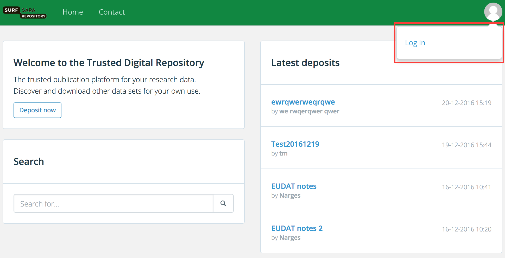 

Click the tab "Create new account", provide the required information and click on the "Create new account" button. Your registration request will be approved by SURFsara and then you can login to use the service.

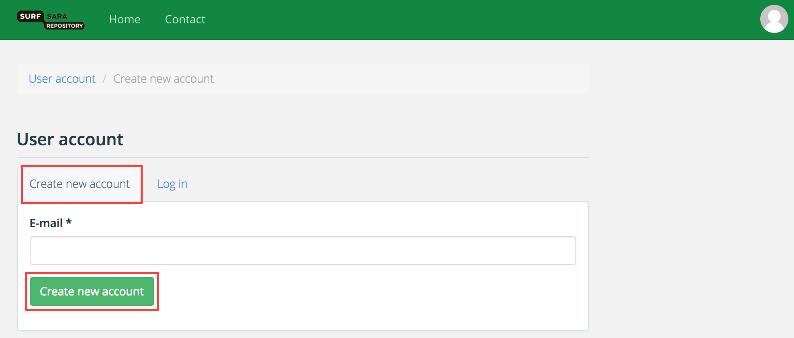 


###Logging in
Login with your user credentials in the [login page of the Data Repository Service] (https://tdr-test.surfsara.nl/user/login).

###Preparing data 

To prepare data for a deposit you need to consider the following points:

- **File formats**
	- **Prefered formats** are file formats of which SURFsara is confident that they will offer the best long-term guarantees in terms of usability, accessibility and sustainability. Depositing research data in preferred formats will always be accepted by SURFsara. Here is a list with [SURFsara prefered formats] (http://datasupport.researchdata.nl/en/start-de-cursus/iii-onderzoeksfase/dataformaten/preferred-formats/)

	- **Acceptale formats** are file formats that are widely used in addition to the preferred formats, and which will be moderately to reasonably usable, accessible and robust in the long term. SURFsara favours the use of preferred formats, but acceptable formats will in most cases also be allowed. Here is a list with [SURFsara acceptable formats](http://datasupport.researchdata.nl/en/start-de-cursus/iii-onderzoeksfase/dataformaten/preferred-formats/)


- **Files size**
	- **Maximum file size**: 4 GB using the online deposit form
	- **minimu file size**: No minumum file size.

	The maximum data file size is 10 GB and the maximum number of files that can be uploaded via the onlone deposite is 100 files.
	
- **Data documentation**
	Data documentation ensures that research data are understood and therefore used by current and future users (including the researcher). It is vital to store the data in a structured and consistent way with appropriate data documentation. The documentation can be a text file explaining what the data is, what you can do with it and how it can be used.
	
- **Metadata**
	 Metadata provides structured information about the data. Depending on the type of data, there are different types of metadata:
	 - **Descriptive metadata** describes and identifies information resources (minimal metdata required to find a digital object). In includes elements such as title, abstract, author, and keywords. 
	- **Structural metadata** provides information about the internal structure of resources including page, section, chapter numbering, indexes, and realtions to other digital objects.
	- **Technical metadata** provides information on the technical aspects of the datasets	 such as data formats, hardware/software used, calibration, version, authentication, encryption.
	- **Administrative metadata**	provides information on user rights and management of digital objects	 such as license, rights management,  and access control.
	
- **Data organisation**
	If you want your research data to be easily traced and interpreted, the folder structure and the file names used for the data files should be logical. Its also a good practice to note the file naming and its meaning in a readme.txt file.
 
- **Data anonymization**
Before you upload the files you should check whether they contain privacy-sensitive information within the meaning of the [Dutch Personal Data Protection Act] (http://www.coe.int/t/dghl/standardsetting/dataprotection/national%20laws/NL_DP_LAW.pdf). 
If you give access to the data, they must be completely anonimyzed. 


###Depositing data 

To deposite data, you should login as a registered user. In the main page click on "Deposit now". Depositing data in Repository service is a 6 step process. 

*  **Step 1: Select and upload files to deposit**
	
	In this step you should provide the files and general information about your deposit. You first need to select the files and then upload them. Make sure that you are uploading an acceptable file format. See [SURFsara acceptable formats](http://datasupport.researchdata.nl/en/start-de-cursus/iii-onderzoeksfase/dataformaten/preferred-formats/).
	If the data format you are trying to upload is not supported, you can always contact us for support. 

	Then enter the general information that is required (Title, Creator and Description). These information will be the basic  metadata for the files. THe fields with * are compolsury.	
	
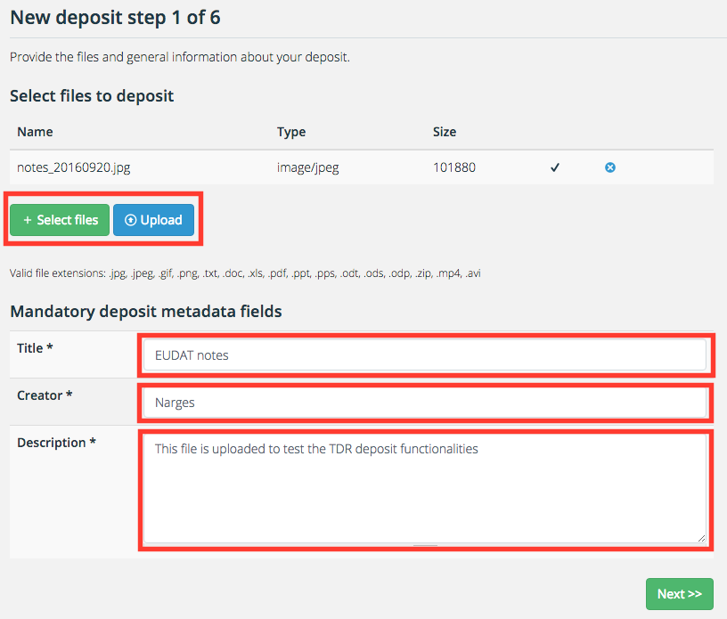 
	
* **Step 2: Select a community, collection and/or metadata schema**
	If you are a memeber of a community and you want to deposit data in that community, select the community name.
	The collection and metadata schema will be prepopulated based on which community you choose. 
	If you are not member of any communities, you will see the collections and schemas defined by yourself.
	This step os optional and can be skipped.
	
	 

* **Step 3: Provide information on privacy, relations and other identifiers**
	
	In this step you can provide any privacy settings such as Embargo and Publish untill. You can also provide any linked information to the data. 
	If the data is not linked and has no privacy constrains you can skip this step.
	
	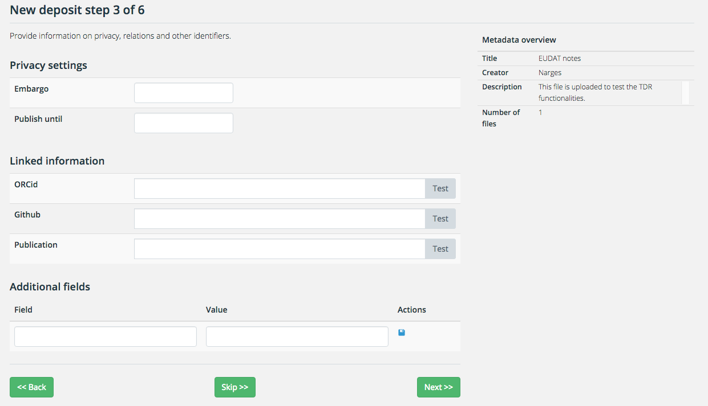 
	
* **Step 4: Select license**
	
	In this step you can select a license for your data. Click on "Choose license" and a license selector tool will be open. If your data is vompletely open to the public, no license is needed and this step can be skipped.
	
	
	
	You can use license selector tool to find the license. If you are not sure which license to choose, answer the questions on the top of the form to find the appropriate license.
	
	
	
	The license you choose will be added to the metadata.
	 
	 
* **Step 5: Terms of Use / Producer contract** 
	
	Please read the terms of use and agree with that by checking the checkbox before depositing data.
	
* **Step 6: Deposit overview**

	In this page you see the deposit overview. You can finalize the deposit by clicking the complete button.
	
	 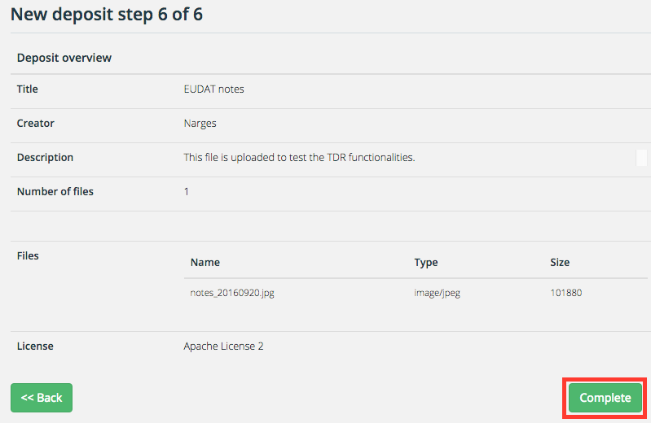
	

	
### Finding datasets
To find a data or metadata, use the search functionality on the home page. You can also see the latest deposits on the the top-right pannel in your homepage. 

  

If you have the PID (Persistent Identifer) of the data you can directly search in the [handle server](http://hdl.handle.net/) and get the url to the location of the data.

###Exporting metadata
To export metadata you should first find the data and then click on the export link on the top-right corner of the metadata pannel. 

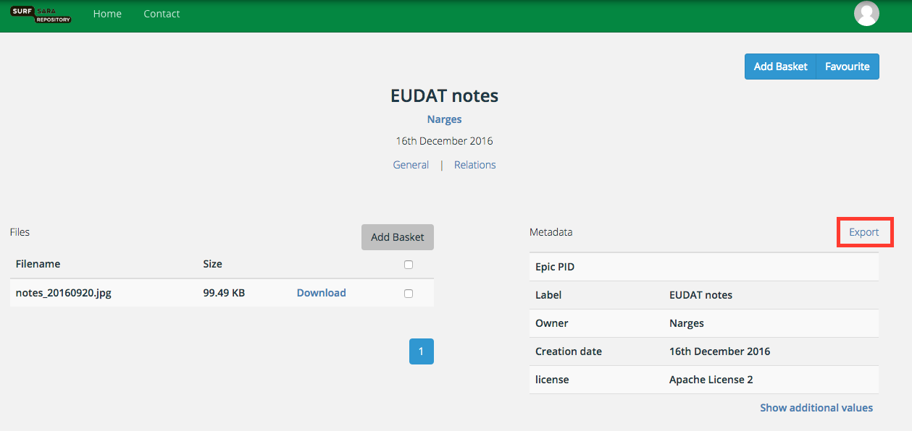

###Downloading files 
You can download single files by going to the data page, selecting the file and click on download. Or you can add more than one files to your basket and then download them at the same time.

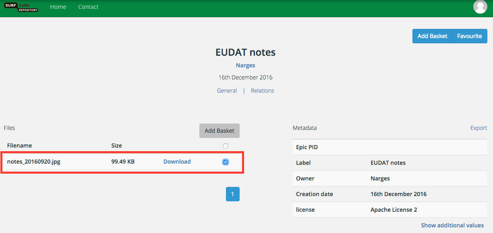

##Advanced Usage
###Metadata schema definition
A metadata schema is a logical plan showing the relationships between metadata fields, normally through establishing rules for the use and management of metadata.

The first question to ask before making a metadata schema is: Is it necessary to create a new metadata schema, or are there already existing metadata schemas which can be adapted for use? We advice to reuse existing schemas. You can find best practices for defining you metadata schema [here] (http://www.niso.org/apps/group_public/download.php/5271/N800R1_Where_to_start_advice_on_creating_a_metadata_schema.pdf).

To define a metadata schema for your data go to your account page. Your current metadata schemas is listed under the Schema part. To create a metadata schema click on "Add Schema".
 
 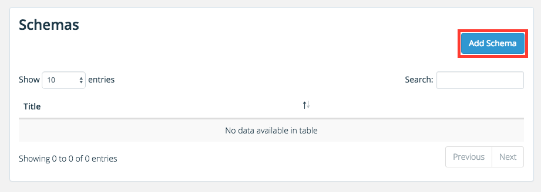
 
 To define the metadata schema you need to provide a name, description and add the metadata fields to the schema.
 
  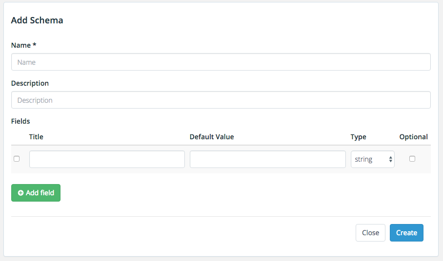
 
###Community/group memberships
To denine a new group or community or to see the list of current groups and communities that you are member of, go to your account page. Click on "Add groupd" or "Add community" to create a new group or community.

 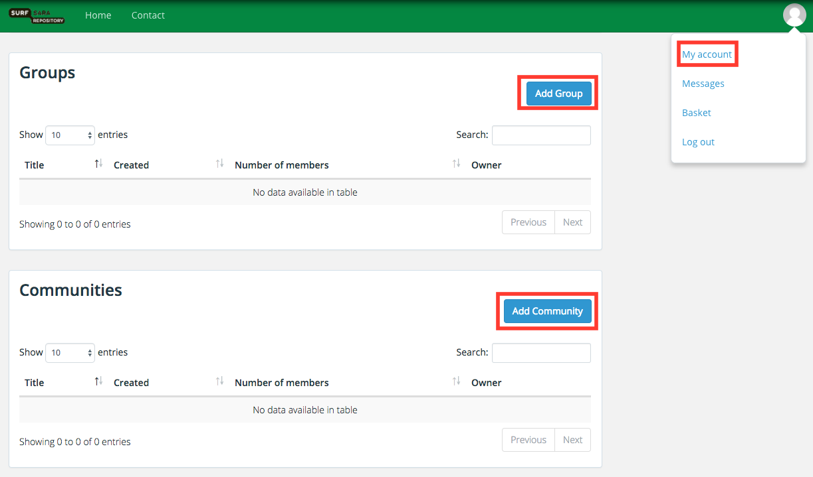

A new page will be open where you need to provide name and description for the group or community and invite other members to join. 

 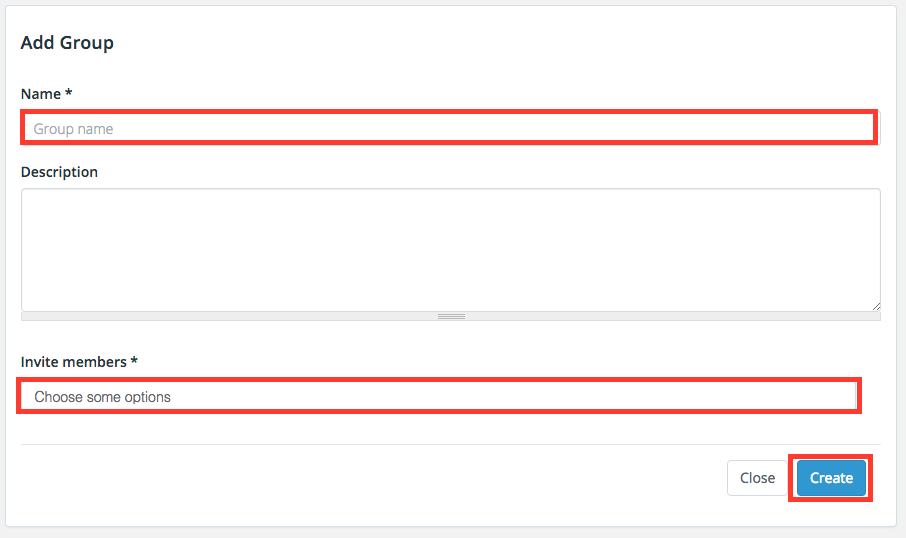


###Download basket 
To be developed (not in the first release).




